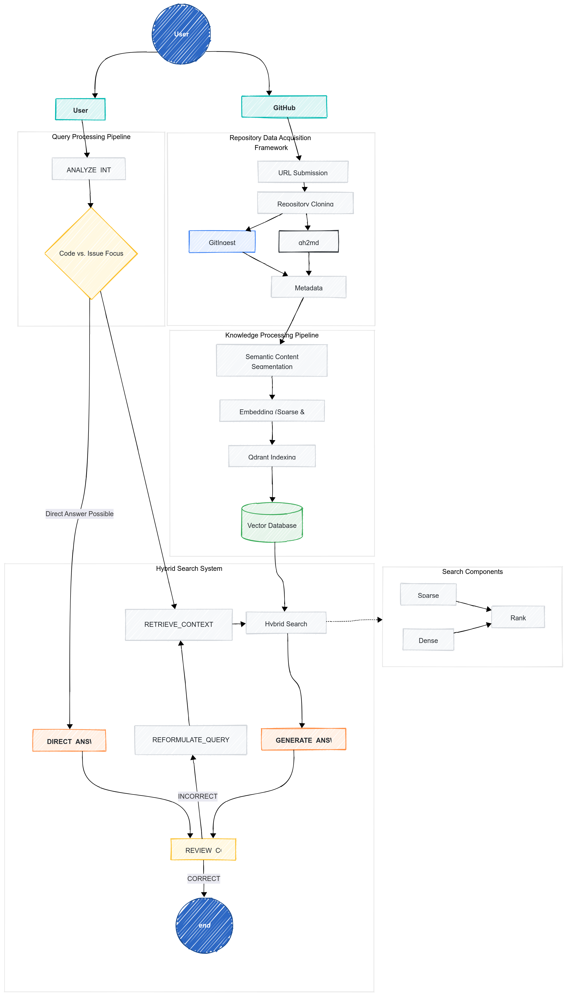

# RepoMind - GitHub Repository Assistant

RepoMind is an AI-powered Retrieval-Augmented Generation (RAG) system designed to provide deep contextual understanding of GitHub repositories. It enables developers to query, analyze, and generate insights based on the entire codebase history, including code, issues, and pull requests. This tool aims to improve collaboration, debugging, and decision-making within development teams.

## Features

-   **Deep Code Understanding:** Analyzes code structure, dependencies, and commit history.
-   **Issue and PR Analysis:** Reviews open issues and pull requests to identify priorities and potential problems.
-   **Intelligent Querying:** Allows users to ask questions about the repository and receive accurate, context-aware answers.
-   **Code Generation:** Can generate code snippets to address specific issues or implement new features.
-   **Streamlit Interface:** Provides an intuitive and user-friendly interface for interacting with the system.
-   **FastAPI Backend:** Utilizes FastAPI for efficient and scalable API endpoints.
-   **Logging:** Implements detailed logging for monitoring and debugging.

## Architecture



The application consists of two main components:

1.  **Backend (FastAPI):**
    -   Handles API requests for processing repositories and answering questions.
    -   Uses `GitHubRepoChunker` to clone, analyze, and chunk the repository.
    -   Leverages a Qdrant vector database (or similar) to store and retrieve code chunks.
    -   Employs a QA agent (`github_qa_agent`) to generate answers based on the retrieved context.
    -   Provides endpoints for:
        -   `/github-qa`: Answering questions about the repository.
        -   `/github-chunk`: Processing and chunking the repository.

2.  **Frontend (Streamlit):**
    -   Provides a user interface for entering a GitHub repository URL and asking questions.
    -   Communicates with the FastAPI backend to process repositories and retrieve answers.
    -   Displays chat history and assistant responses.
    -   Includes features like:
        -   Repository processing progress indicator.
        -   Example prompts to guide users.
        -   "New Repository" button to clear the current session.

## Setup and Installation

### Prerequisites

-   Python 3.7+
-   Poetry (recommended) or pip
-   Git
-   A Qdrant instance (or other vector database)

### Installation Steps

1.  **Clone the repository:**

    ```bash
    git clone <repository_url>
    cd <repository_directory>
    ```

2.  **Install dependencies:**

    Using Poetry (recommended):

    ```bash
    poetry install
    ```

    Using pip:

    ```bash
    pip install -r requirements.txt
    ```

3.  **Set up environment variables:**

    Create a `.env` file in the root directory and add the necessary environment variables, such as:

    ```
    QDRANT_HOST=<qdrant_host>
    QDRANT_PORT=<qdrant_port>
    OPENAI_API_KEY=<openai_api_key>
    ```

    Make sure to load the environment variables in both `app.py` and `frontend.py` using `load_dotenv()`.

4.  **Run the backend (FastAPI):**

    ```bash
    poetry run uvicorn app:app --reload
    ```

    Or:

    ```bash
    python app.py
    ```

5.  **Run the frontend (Streamlit):**

    ```bash
    poetry run streamlit run frontend.py
    ```

    Or:

    ```bash
    streamlit run frontend.py
    ```

## Usage

1.  **Enter a GitHub Repository URL:** In the Streamlit interface, enter the URL of the GitHub repository you want to analyze.
2.  **Process the Repository:** Click the "Process Repository" button. The system will clone the repository, analyze its code structure, process issues and PRs, and prepare the AI response engine.  A progress bar will indicate the status.
3.  **Ask Questions:** Once the repository is processed, you can ask questions about the repository in the chat interface. The assistant will provide answers based on the repository's context.
4.  **Example Prompts:** Use the example prompts provided to guide your questions.
5.  **New Repository:** To analyze a different repository, click the "New Repository" button to clear the current session and enter a new URL.

## Code Overview

### `app.py` (FastAPI Backend)

-   Defines the API endpoints for processing repositories and answering questions.
-   Uses `GitHubRepoChunker` to handle repository analysis and chunking.
-   Implements logging for monitoring and debugging.
-   Handles errors and returns appropriate HTTP responses.

### `frontend.py` (Streamlit Frontend)

-   Provides the user interface for interacting with the system.
-   Allows users to enter a GitHub repository URL and ask questions.
-   Displays chat history and assistant responses.
-   Communicates with the FastAPI backend to process repositories and retrieve answers.
-   Includes features like a repository processing progress indicator and example prompts.

### `agent.py` (Agent Logic)

-   Contains the core logic for analyzing GitHub repositories and generating answers.
-   The `GitHubRepoChunker` class handles cloning, analyzing, and chunking the repository.
-   The `github_qa_agent` function uses a QA model to generate answers based on the retrieved context.

## Contributing

Contributions are welcome! Please submit pull requests with detailed descriptions of the changes.